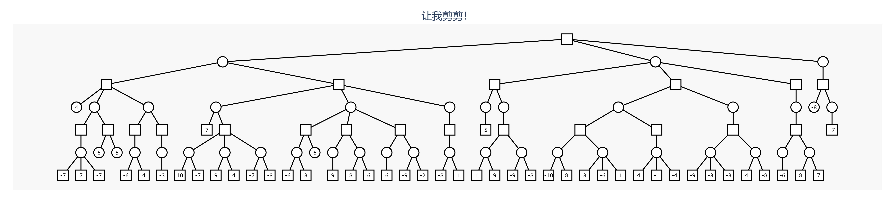
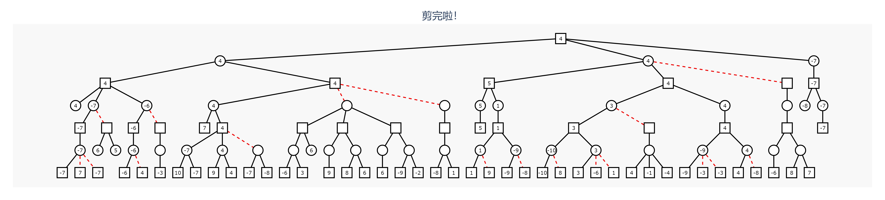

# IAI Gen
复习得是不是有点烦躁？练习题太少？这里提供批量生成人智导练习题的工具


首先配置环境
```bash
pip install -r requirements.txt
```

## SVM

模仿 2021 年的期末考题，随机生成一道训练集大小为 3 的二元 SVM 问题及其逐步骤的详细解答。

### Example

见 `example/svm_*.md`。

### 运行
```bash
python svm.py
```

### 配置说明

题目和解答的模板见 `template/svm_problem.md` 和 `template/svm_solution.md`。

```bash
"range": 随机取样范围，将在 [-range, range] 中的整数中随机取样生成向量
"kernels": 可供选择的核函数。"repr" 是函数运算时执行的代码，"str" 是LaTex格式的函数表达
"random": 是否随机生成
```


## A* 算法

TODO

## Alpha-Beta 剪枝

随机生成一道 Alpha-Beta 剪枝题目及其解答。

生成时先生成一颗满树，然后随机删除子树，直到叶子数足够少。约束条件见配置。然后试着给树叶赋值，如果赋值 200 次后仍然剪枝次数太少，就重新生成，直到树的剪枝数足够多，同时叶子也足够少为止。

（如果条件比较苛刻可能反复生成十几次才能达到要求qwq

### Example



### 运行
```bash
python tree.py
```
运行后会根据 `settings.json` 中的配置，将题目和解答生成到 `img` 目录下。其中，`todo_**.jpg` 是题目，`done_**.jpg` 是解答，`**` 是生成是使用的随机数种子。

运行时，输出平均分支数，节点数和剪枝数。

运行过程中输出
```bash
tree.py:93: RuntimeWarning: Couldn't reach some vertices at src/paths/unweighted.c:368
  path = graph.get_shortest_paths(0, nd)[0]
```
是预期内的行为。

### 配置说明

```bash
"max_ch": 最大分枝数
"layers": 层数
"max_leaves": 叶子数上限
"min_clip": 剪枝次数下限
"show_clip_count": 是否在stdout输出有多少剪枝
"distinguish_max_min": 图中是否区分极大极小节点
"save_path": 生成图片保存路径
```

## 决策树

TODO

## 神经网络设计

TOOD

## 一套人智导期末试卷

TODO
